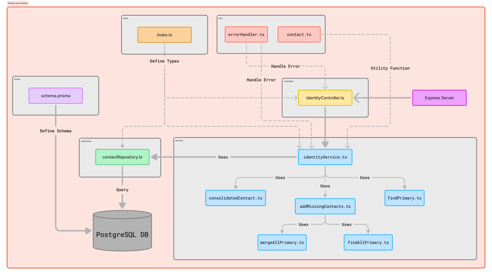

# Identity Reconciliation Project

## Table of Contents
1. [Project Overview](#project-overview)
2. [System Design](#system-design)
3. [Folder Structure](#folder-structure)
4. [Setup and Installation](#setup-and-installation)
5. [API Documentation](#api-documentation)
6. [Technologies Used](#technologies-used)
7. [Contributing](#contributing)
8. [License](#license)

## Project Overview

This project implements an identity reconciliation system for FluxKart.com, an online store. The system aims to link different orders made with varying contact information to the same customer, providing a personalized experience and rewarding loyal customers.

The main features include:
- Identifying and tracking a customer's identity across multiple purchases
- Linking different contact information (email and phone number) to a single customer
- Maintaining a hierarchy of primary and secondary contacts

## System Design



The system follows a layered architecture with the following components:

1. **API Layer**: Handles HTTP requests and input validation
2. **Service Layer**: Implements core business logic for contact identification and consolidation
3. **Repository Layer**: Manages database operations
4. **Database Layer**: Stores contact information using PostgreSQL
5. **Figma Link of design**: 

## Folder Structure

```
identity-reconciliation/
│
├── src/
│   ├── controllers/
│   │   └── identityController.ts
│   ├── middleware/
│   │   └── errorHandler.ts
│   ├── services/
│   │   ├── identityService.ts
│   │   ├── addMissingContacts.ts
│   │   ├── consolidatedContact.ts
│   │   ├── findAllPrimary.ts
│   │   ├── findPrimary.ts
│   │   └── mergeAllPrimary.ts
│   ├── repositories/
│   │   └── contactRepository.ts
│   ├── utils/
│   │   ├── errorHandler.ts
│   │   └── contact.ts
│   ├── types/
│   │   └── index.ts
│   └── index.ts
├── prisma/
│   └── schema.prisma
├── diagram/
│   └── system-design.png
├── .gitignore
├── package.json
├── tsconfig.json
└── Readme.md
```

## Setup and Installation

1. Clone the repository:
   ```
   git clone https://github.com/dalaixlmao/identify-reconciliation.git
   cd identity-reconciliation
   ```

2. Install dependencies:
   ```
   npm install
   ```

3. Set up the database:
   - Create a PostgreSQL database
   - Update `.env` and the `DATABASE_URL` in it

4. Run database migrations:
   ```
   npx prisma migrate dev
   ```

5. Run database generation:
   ```
   npx prisma generate
   ```

6. Start the server:
   ```
   npm run dev
   ```

## API Documentation

### Endpoint: `/identify`

**Method:** POST

**Request Body:**
```json
{
  "email": string | null,
  "phoneNumber": string | null
}
```

**Response:**
```json
{
  "contact": {
    "primaryContactId": number,
    "emails": string[],
    "phoneNumbers": string[],
    "secondaryContactIds": number[]
  }
}
```

## Technologies Used

- Node.js with TypeScript
- Express.js
- PostgreSQL
- Prisma ORM
